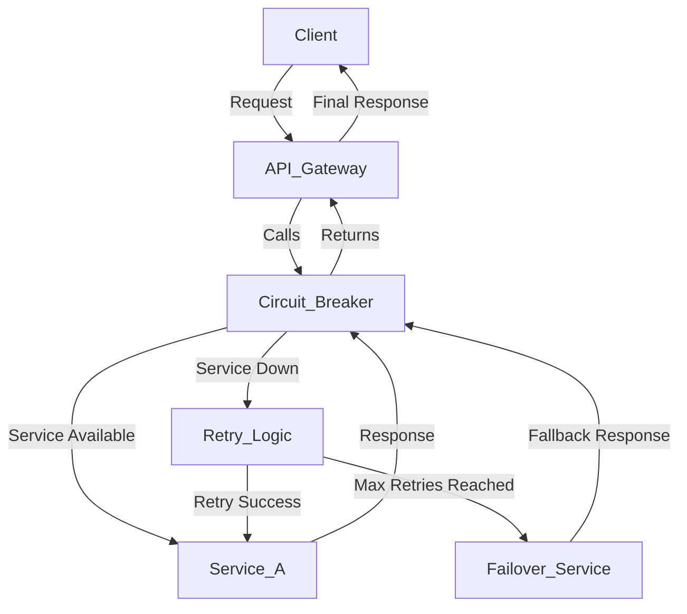
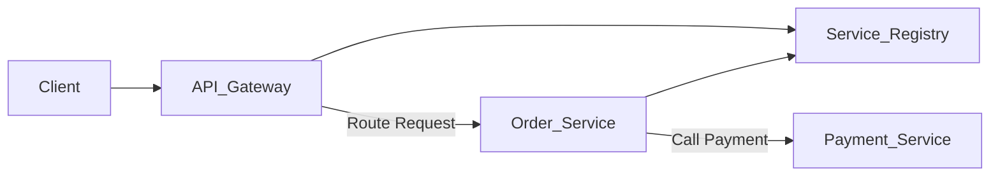

# High Load System

Çok fazla kullanıcıdan gelen istekleri hızlı, güvenilir ve bozulmadan karşılayabilen sistemlerdir.

1. High Load Sistemlerin Ana Hedefleri

- Scalability (Ölçeklenebilirlik): Trafik arttıkça sistemin çökmesi yerine büyüyerek cevap verebilmesidir. (örn: Cloud provider)

- Availability (Erişilebilirlik): Sistem çalışmaya devam etmeli, kesinti olmamalı.

- Reliability (Güvenilirlik): Veriler kaybolmamalı.

## Realistic Senario:

Diyelim ki kendi URL Shortener sistemimizi yapıyoruz. (bit.ly gibi)

- Günlük 10 milyar yeni link oluşturuyor.
- Günlük 2 milyar tıklama geliyor.

Bu ne demek ?

```
Günde 2.000.000.000 tıklama
-> Saniye yaklaşık 23.148 istek (avarage)
-> Pik zamanlarda bu 5x' e çıkar. ~115.000 istek/saniye
```

👉 Bu yükü tek bir sunucu kaldıramaz. İşte bu yüzden High Load mimarisi gerekir.

**High Load Sistemlerin olayı sadece güçlü donanım değil, trafiği doğru yönetebilmektir.**

---

# Scaling Yöntemleri

Yüksek trafikli sistemler kurgularken ilk büyük karar şudur:

**Gücü artırarak mı ölçeceğim, yoksa sayıyı artırarak mı ?**

1. Vertical Scaling (Scale Up) - "Sunucuyu Büyüt"

- Var olan sunucuya daha fazla RAM/CPU/Disk ekliyorsun.
- Kolaydır ama sınırı vardır.

Avantajları:

- Yönetmesi kolaydır.
- Kodda değişiklik gerekmez.

Dezavantajları:

- Bir noktadan sonra en büyük sunucuyu bile satın alamazsın.
- Tek bir failure point -> Sunucu çökerse tüm sistem komple gider.

2. Horizontal Scaling (Scale Out) - "Sunucuyu Çoğalt"

- Tek sunucuyu büyütmek yerine aynı sunucudan 10,100,100 tane koyulması.
- İsteklerin Load Balancer ile dağıtılması.

### Load Balancer (Yük Dengeleyici)

Horizontal Scaling' in kalbi. Müşteriden gelen istekleri alır, sunucuları eşit şekilde dağıtır.

```
Client-> Load Balancer -> Server1 / Server2 / Server3

```

**Popüler Load Balancer' lar :**

| `Yazılım Bazlı` | `Cloud Managed`                   |
| --------------- | --------------------------------- |
| nginx,HAProxy   | AWS ELB/ ALB, Google LB, Azure LB |

> Vertical Scaling neden uzun vadede sürdürülebilir değildir?

```
Veritical scaling uzun vadeli sürdürülebilir olmamasının sebebi her sunucu bilgisayarının büyütülmesi için bir limit olmasıdır.
```

> Horizontal Scaling kullanırken tek bir kritik bileşen vardır — o nedir?

```
Horizontal Scaling kullanırken kritik bileşen Load Balancer' dır.
```

> Load Balancer'dan sonra sistemde stateful olmanın neden sorun olabileceğini tahmin edebiliyor musun?

```
Çünkü istekler her seferinde farklı sunucuya gidebilir ve sunucu içinde tutulan session / kullanıcı bilgisi kaybolur.
```

---

# Stateless vs Stateful Sistemler

Load Balancer ile sunucular çoğaltıldığında şöyle bir durum oluşur.

```
Client -> Load Balancer -> Server A
Client -> Load Balancer -> Server B
Client -> Load Balancer -> Server C

```

Eğer bir kullanıcıyla ilgili oturum (login bilgisi, sepet, geçici işlem verisi) sunucunun içinde saklanmışsa buna :

**Stateful Server** (durum tutan sunucu) denir.

Problem şudur:

- Kullanıcı ilk istekte Server A' ya düşer i login olur (session Server A' da tutulur.)
- Sonraki istek Server B' ye düşerse -> kullanıcı yeniden login olmak zorunda kalır.

**İşte bu yüzden High Load sistemlerde 'State' sunucuda saklanmaz. Ortak bir yere alınır.**

Bu sisteme **Stateless Architecture** denir.

> Load Balancer'dan sonra sistemde stateful olmanın neden sorun olabileceğini tahmin edebiliyor musun?

**Çözüm:**

| `State Saklama Yeri` | `Açıklama`                                                                 |
| -------------------- | -------------------------------------------------------------------------- |
| Redis                | En çok kullanılan shared session store                                     |
| Database             | Kullanıcı bilgisi DB' de tutulabilir                                       |
| JWT/ Token           | Durumu client tarafına encode edip geri gönderirsin. (sunucu state tutmaz) |

### 🔁 Bonus: Sticky Session Nedir?

Eğer stateless yapı kurmak istemiyorsan Load Balancer' a "Bu kullanıcı hep aynı sunucuya düşsün." diyebilirsin. Buna **sticky session/session affinity** denir.

**Ama High Load sistemlerde tavsiye edilmez, çünkü sunucu ölürse session' da gider.**

Stateful ve Stateless sorununun somut bir örneği

## Örnek E-ticaret Sitesinde Sepet Sistemi:

Sen bir e-ticaret sitesi yapıyorsun (HepsiBurada/ Trendyol gibi). Kullanıcı ürüne tıklayıp **sepete ekle** diyor.

- 🧨 Hatalı Stateful Mimarisi:

```
Client -> Load Balancer -> Server A (Sepeti RAM' de tutuyor.)
```

Kullanıcı ikinci ürünü eklediğinde:

```
Client -> Load Balancer -> Server B (Bu sunucuda sepet boş!)
```

> Kullanıcı "Sepetim kayboldu" diye çıldırır. Çünkü state(durum) sunucuya kilitli kalmıştır.

- ✅ Doğru (Stateless) Mimarisi:

```
Client -> Load Balancer -> Server X -> Sepeti Redis/ DB/ Token' a kayıt eder.
Client -> Load Balancer -> Server Y -> Sepeti Redis' ten okur.
```

**Hangi sunucuya düşerse düşsün, client' ın durumu ortak bir yerde tutulur.**

- 1️⃣ : Bu örnekte State'i merkezi tutmak için en mantıklı yer neresi olabilir ?

1. Database(Sepet tablosu içersinde tutmak)
2. Redis(Hızlı cache depolama)
3. JWT Token(Sepeti client tarafına encode edip cookie içerisinde taşımak)

- Cevap :

```
Ben 2. cevabı seçerdim redis' te tutmak daha mantıklı. Database' de tutmak da mantıklı olabilir.
Ancak tek mantıksız olan yol token' da saklamak olduğunu düşünüyorum.
Çünkü token süresinin belirli expire süresi var ve bu süre belki 1 hafta sonra dolabilir ve sepet datası kaybolabilir.
```

**Cevap değerlendirmesi:**

| `Seçenek`          | `Avantaj`                               | `Dezavantaj`                                                            | `Değerlendirme`                             |
| ------------------ | --------------------------------------- | ----------------------------------------------------------------------- | ------------------------------------------- |
| DB' de saklamak    | Kalıcı, güvenli                         | Yavaş (her sepet aksiyonunda DB sorgusu döner -> yük bindirir.)         | Mantıklı ama ağır olabilir.                 |
| Redis' te saklamak | Çok hızlı(in-memory) TTL ayarlanabilir. | Redis çökse data kaybolabilir -> **ama backup/replication yapılabilir** | Sepet gibi "geçici state" için ideal tercih |
| Token' da saklamak | Sunucusuz, stateless                    | Token şişer (büyük payload), expire olursa sepet kaybolur.              | Riskli                                      |

**Yani Redis, üçünün arasında en dengeli olanı** -- hem stateless sistemi destekler, hem de yüksek trafikte hızlı çalışır.

---

# Cache & Database Stratejileri (Redis+DB İlişkisi)

Bu derste şu netleştirilecek.

> "Veri nereye yazılmalı? Cache nereye, database nereye? Hangisi önce okunmalı?"

**3 çeşit cache stratejisi vardır.**

1. **Read-Through Cache:** Client DB' ye gitmez. -> Cache' e gider. Cache' de yoksa DB' den çeker. (Kullanıcı verileri, profil bilgisi vb.)
2. **Write-Through Cache:** Yazılan her veri önce cache' e, sonra DB' ye yazılır. (Kalıcı olması gereken data)
3. **Write-Back (Write-Behind):** Veri önce sadece cache'e yazılır, sonra arkadan DB' ye flush edilir. (Sepet/ Like sistemi gibi geçici, toleranslı veriler)

Sistem ve kullanılan cache stratejisi olarak incelersek:

| `Sistem`       | `Cache Stratejisi`                                                                       |
| -------------- | ---------------------------------------------------------------------------------------- |
| User Profile   | **Read-Through** (cache varsa ordan oku, yoksa DB' den çek.)                             |
| Sepet          | **Write-Back** (Redis'te tut -> Db' ye periyodik yazabilirsin veya hiç yazmayabilirsin.) |
| Banka Bakiyesi | Asla cache yazarken DB' ye gecikmeli gitmemeli -- **Write-Through** yada direkt DB       |

- Cache, verinin kopyasıdır. Database' in yerine geçmez.
- Redis gibi cache' ler volatile (uçucu) olabilir; tamamen kritik olan veriler için DB garanti noktasıdır.
- Sepet gibi geçici ama hızlı olması gereken şeyleri Redis' te tutmak en makul yoldur.

**Sepet sipariş mantığında 'Sepet = geçici state', 'Sipariş = kalıcı state' olarak değerlendirilebilir.**

---

# Replication & Consistency (Master-Slave/ Primary-Replica/ Strong vs Eventual)

Şimdi sistemleri çoğalttık (scaling), cache' e aldık (Redis). Sıradaki soru:

> Database' i nasıl ölçeklendiririz?
> Yani High Load altında okumalar ve yazmalar nasıl dağıtılır?

## Database Replication Nedir ?

Bir DB' yi birden fazla kopya olarak tutmak demektir.

**Roller:**

1. Primary(Master): Tüm yazmalar (INSERT/UPDATE) buraya yapılır.
2. Replica(Slave/Read Replica): Sadece okumalar yapılır.(SELECT)

Yazma/ Okuma Ayrımı Böyle Çalışır:

```
Client(Write) -> Primary DB
Client(Read)  -> Replica DB' ler
```

Böylece yük paylaşılmış olur.

⚠️ Ancak burada bir sorun var : **Replication Lag**

- Primary DB' ye veri yazılır.
- Replica bu veriyi hemen mi alır? -> _Hayır, çoğu zaman gecikmeli gelir._

Bu yüzden ortaya iki tip tutarlılık modeli çıkar:

1. **Strong Consistency:** Yazılan veri anında tüm DB' lerde görünür. (Örn: Bankacılık Sistemleri)
2. **Eventual Consistency:** Veriler kısa süreliğine farklı olabilir, ama sonunda eşitlenir. (Örn: Sosyal Medya like sayıları)

### Eventual Consistency' nin Klasik Örnekleri:

Sen instagramda bir postu like' ladın.

- Hemen altta "12502 -> 12503 beğeni" olur.
- Arkadaşın telefonunda hala 12502 görünüyor.

**Bu bir bug değil eventual consistency' dir.**

- 1️⃣: Bir e-ticaret sitesinde "ürün stok sayısı" sence hangi modelle tutulmalı? (Strong mu, Eventual mı?) Neden ?

- Cevap: Bir e-ticaret sitesinde ürünün stok sayısı strong consistency ile tutulabilir.
  Çünkü sepete ekleyip sipariş verildiğinde eğer bir gecikme yaşanırsa sonrasında siparişin iptali gibi
  müşterilerde olumsuz durumlara yol açma riski vardır.

- 2️⃣: **Kullanıcı profiline ait gösterilen takipçi sayısı** sence strong consistency mi gerektirir yoksa eventual olabilir mi?

- Cevap: Kullanıcı profiline ait gösterilen takipçi sayısı eventual consistency ile işlem yapılması daha sağlıklı olur.
  Çünkü 1. cevapdaki gibi çok çok olumsuz durumlara ve sonrasında yaşanacak krizlere sebebiyet verecek bir öncelik olmadığını düşünüyorum.

**Kritik olmayan datalarda Eventual Consistency, kritik datalarda Strong Consistency seçimi yapılır. High Load sistem tasarımı tam da bu dengeyi kurmak demektir.**

---

# Partitioning/ Sharding (Gerçek Ölçeklenme Burada Başlar.)

Cache ekledik. Replication yaptık ama bir noktada tek bir Primary DB bile yetmeyecek.

İşte bu durumda yapılacak şey:

> Database'i bölmek.

## Partitioning/ Sharding Nedir?

**Devasa bir tabloyu veya database' iki ya da daha fazla parçaya bölmek.**

Böylece:

```
instread of -> 1 DB with 1M users
we do -> 10 DB each with 10K users
```

### Sharding Yöntemleri:

1. **Range Sharding:** Alfabetik veya ID aralığına göre _(Örn: A-M -> DB1, N-Z -> DB2)_
2. **Hash Sharding:** ID' yi hash' leyip mod alarak _(Örn: user_id % 4 -> 4 farklı shard)_
3. **Geo Sharding:** Lokasyona göre _(Örn: Avrupa ayrı DB, Amerika ayrı DB)_
4. **Feature/Entity Based:** Veri tipine göre _(Örn: dbo.Users tablosu farklı, dbo.Orders farklı DB' de )_

- Örnek: Kullanıcıları Hash ile Shard Et:

```
Shard = user_id % 4

user_id = 341 => 341 % 4 = 1 -> Database A
user_id = 762 => 762 % 4 = 2 -> Database B

```

**Her sunucu sadece kendi parçasını bilir -> yük dağıtılır,sorgular hızlanır.**

**Sharding Sorunları:**

1. **Cross-Shard Query:** "Bir kullanıcının 5 siparişi, 3 yorumu ve 2 adresi var." -> hepsi farklı DB' de ise toplamak zorlaşır.
2. **Shard Rebalancing:** "Shard 1 çok doldu,2 boş kaldı" gibi durumlarda yeniden dağıtım gerektirir.
3. **ID Uniqueness:** Farklı shard' lardaki veriler çakışabilir. -> _global_id_ sistemi gerekebilir.

- 1️⃣: Sence “Kullanıcı tablosu”nu sharding yapmak mantıklıdır ama “Ürün kategorileri” tablosunu sharding yapmak mantıklı mıdır? Neden?

- Cevap: Bence ürün kategorileri tablosunu sharding yapmak çok değildir. Çünkü kategorilerin mutlak bir sınırı vardır. Bu yüzden datanın bölünmesi gerektiğini düşünmüyorum.

- 2️⃣: Sharding yapıldığında "user_id = 1234" için hangi shard kullanılabileceğini nasıl bilebiliriz. (Senin önerdiğin yöntem)

- Cevap: Çok büyük bir trafik düşündüğümüzde mesela amazon gibi. Önce Geo Sharding yöntemi ile bölgelere ayırıp ardından aynı bölgelerdeki kullanıcılar için de Hash Sharding kullanarak daha verimli bir bölümleme ile sistemin daha stabil ve hızlı çalışabileceğini düşünüyorum.
  Mesela Türkiye' de kayıt olan bir amazon kullanıcısı Geo Sharding yöntemi ile TR sunucularına kayıt olacak ardından TR' de bulunan istanbul, Ankara veya İzmir gibi illerde bulunan sunucularında Hash Sharding kullanarak veri paylaşımı yapmak daha sağlıklı olabilir. Cevap Amerika için yine Amazon gibi yüksek trafikli bir sistemden bahsedecek olursak ilk olarak Geo sharing ile kıta bazlı ABD sunucusu olarak böler sonrasında yine Geo sharding ile bu sefer ABD içerisindeki sunucuları eyalet bazlı bölerdim ve eyalatlerde bulunan sunucuları Hash Sharding ile bölmeyi düşnürdüm. Mesela Washington için aktif 30 sunucu varsa bu 30 sunucu da Hash Sharding yöntemi uygulardım.

> **Eğer data çok küçükse -> bölmek yerine tüm sunuculara kopyalamak daha mantıklıdır. (Replication)**

> **Eğer data büyükse -> parçalamak zorundayız. (Sharding)**

---

# Message Queues & Asenkron İşlem (Event Driven Architecture)

## ✅ Message Queue Nedir?

> Üretilen olarayları (event) _hemen işlemek sıraya koymak_ ve asenkron **(gecikmeli ama garantili)** şekilde işlemek için kullanılan sistemdir.

### 📌Neden Kullanılır?

Çünkü gerçek dünyada bazı işlemler hemen yapılmak zorunda değildir.

| `İşlem`                                        | `Senkron Durumu`                              |
| ---------------------------------------------- | --------------------------------------------- |
| Kullanıcı 'Pay' butonuna bastı - > Ödeme Onayı | Senkron olmalı(Hemen cevap vermeli)           |
| Ödemeden sonra 'Mail Gönder'                   | Asenkron (Sıra kuyruğa yaz, arkadan işlenir.) |
| Like sayısını artır                            | Asenkron yapılabilir                          |
| Kullanıcıya bildirim gönder                    | Kuyruğa atılabilir                            |
| büyük resmi sıkıştır.                          | Kuyruğa at                                    |

### Queue Kullanmazsan Ne Olur ?

Örnek:

```
POST /buy

-> DB insert
-> Stok azalt
-> Mail gönder
-> PDF Fatura oluştur
-> Bildirim gönder
-> Slack mesajı gönder
```

Hepsini aynı anda yaparsan 5 saniye sürer. Kullanıcı "bozuldu mu?" diye sayfayı kapatır.

### Queue ile Doğru Mimari

```
POST /buy
-> DB insert + Stok düş (sadece ana işlem)
-> Event "OrderCreated" kuyruğa yazılır
-> Worker' lar arkadan: Mail, Fatura, Bildirim, Slack gönderir.
```

Kullanıcıya cevap verilir. -> **Sipariş Alındı**

Arka planda herşey devam eder.

**Message Queue Örnekleri:**

| `Sistem`             | `Type`            | `Kullanım`                      |
| -------------------- | ----------------- | ------------------------------- |
| RabbitMQ             | Message Broker    | Küçük-Orta Sistemler            |
| Kafka                | Event Streaming   | Yüksek throughput -> 1M+ events |
| AWS SQS, GCP Pub/Sub | Cloud Queue       | Serverless kullanım             |
| Redis Stream         | Lightweight Queue | Basit İşler için                |

- 1️⃣: Bir e-ticaret sitesinde "Sipariş verildiğinde mail gönderme" işlemi sence Senkron mu olmalı, Asenkron mu? Neden ?

- Cevap: Bence asenkron olmalı. Senkron bir sipariş akışı tasarlanmış ve canlı data yazılmış. Kullanıcı artık siparişini vermiş ve gerekli stok işlemleri yapılmış. Bu yüzden mail kullanıcı için bir ek bilgilendirme. Kuyruğa alınıp bekletilebilir.

- 2️⃣: Like butonuna basıldığında sayacı hemen artırmak mı gerekir, yoksa Queue' ya atıp gecikmeli artırmak da olur mu?

- Cevap: İlk sayaç işlemi cache' de yapılıp cache' deki sayacın artılırılıp canlı yazma işlemi asenkron yapılması daha sağlıklı olur. Çünkü ünlü bir influencer' ın sosyal medya postu saniyeler içerisinde çok fazla trafik alabilir. Bu yüzden canlı data olarak aktarma işlemi asenkron olarak yapılması ve kuyruk yapısı ile kurgulanması daha sağlıklı olur.

**İkinci sorunun cevabı için "Burst Traffic" ihtimalinin düşünülmüş olması gayet mantıklı. Büyük sistemler (Instagram, Twitter) exactly this! yöntemini kullanmaktadır.**

---

# Eventual Consistency Gerçek Dünyada Nasıl Yönetilir?

Consistency konusuna önce teorik olarak baktık ama şimdi eventual consistency ile yapılan tutarsızlıklar nasıl yönetilir kısmına geçelim.

## Senaryo:

Bir e-ticaret sitesindesin.

- Kullanıcı Siparişi Verdi -> Ödeme Alındı ✅
- Ama arkaplanda çalışan asenkron işlemlerden biri **BAŞARISIZ** oldu. (örneğin stok güncellemesi yapmadı.)

| `Strateji`                         | `Açıklama`                                                                                 | `Risk`                                                  |
| ---------------------------------- | ------------------------------------------------------------------------------------------ | ------------------------------------------------------- |
| Strong Consistency (Transactional) | Tüm adımlar aynı anda yapılır, biri fail olursa geri alınır.                               | Kullanıcı bekler, yavaşlatır.                           |
| Eventual Consistency + Retry Queue | Başaramayan event tekrar kuyruğa atılır ve yeniden denenir.                                | Bazı event' lar _eninde sonunda_ olur ama geç olabilir. |
| SAGA Pattern (Compensating Action) | **Eğer stok güncellemesi başarısız ise -> Siparişi otomatik iptal et ve parayı geri öde.** | Kullanıcıyı üzmeden rollback.                           |

## SAGA Pattern (Dağıtık Transactionların Kurtarıcısı)

| `Step` | `Process`           | `Is Success?`              |
| ------ | ------------------- | -------------------------- |
| 1      | Payment-> Success   | Compensate: Para iadesi    |
| 2      | Stok düş            | Compensate: Stok Geri Ekle |
| 3      | Siparişi DB' ye yaz | Compensate: Satır sil      |
| 4      | Mail gönder         | (Gerek yok, sadece logla)  |

- 1️⃣ Eventual consistency kullanılan sistemlerde “başarısız event’ler” için nasıl bir strateji uygulanmalıdır? Retry mi, kompanzasyon mu, loglayıp bırakmak mı? Sen nasıl karar verirsin?

- Cevap: Başarısız event' lar için transactional işlem uygulanabilir. Bir siparişin verildiğini varsayalım. Ödeme ve Stoktan düşme işlemi Strong Consistency yapısı ile yapılmış olsun.
  Kuyruk yapısı kullanılarak mail gönderme gibi işlemler söz konusu. Kuyrukda hata alındığında mail gönderme, fatura kesme gibi işlemler SAGA Pattern ile yapılabilir.
  Yada yalnızca ödeme adımları Strong Consistency ile yapıldıysa. Stoktan düşme, mail gönderme ve fatura gönderme gibi işlemlerde SAGA Pattern kullanılarak işlemler geri alınabilir sipariş iptal edilip para iadesi sağlanabilir. İki yolda sağlıklıdır.

- 2️⃣ Sence bir bankacılık sisteminde “para transferi” eventual consistency olabilir mi? Yoksa strong mu olmak zorunda?

- Cevap: Bence bir bankacılık sisteminde para transferi işlemi kuyruk yapısı ile yapılmalı. Yani Eventrual Consistency ve denenebilir kuyruk yapısı kullanılabilir. Çünkü bankacılık sistemlerinde para transferi yapılırken istek yapılan servislerde farklı farklı sorgulama servisleri çalışabilir ve bu trafiğin yönetilmesi için Eventual Consistency daha uygundur.

---

# Read-Heavy Trafikte Replication & CQRS

### Problem:

Bir sistemde:

1. %10 Write (INSERT /UPDATE/ DELETE)
2. %90 Read (SELECT)

yapılıyor olsun.

Bu durumda bütün read isteklerini primary database' den yapmak mantıklı mıdır ?

> Hayır. Çünkü primary sürekli yazma da yapıyor. -> Okuma yükü geldiğinde yavaşlar.

### Çözüm:

| `Veri`                        | `Nereden okunur?`  | `Nereden yazılır?` |
| ----------------------------- | ------------------ | ------------------ |
| Yazma işlemi (CREATE/ UPDATE) | -> Primary DB      | ✅                 |
| Okuma işlemi (GET/ LIST)      | -> Read Replica DB | ✅                 |

Bu yapıya çoğu zaman CQRS (Command Query Responsibility Segregation) denir.

**Mimari:**

```
        WRITE
App -------------> Primary DB
|
READ
|
-----------------> Read-Replica-1
|
-----------------> Read-Replica-2
```

- 1️⃣ Sadece **read heavy** olan bir endpoint (örneğin: Trend ürünleri listeleme) hangi DB’den okunmalı? Primary mı, Replica mı?

- Cevap: Trend ürünleri listelemek farklı replica database'lerden okunması daha sağlıklı olur. Çünkü trend ürünler belirli ortalamaya göre değişiklik gösterebilir. Değişen bir veri olduğu için Replica' dan okumak daha sağlıklı olabilir.

- 2️⃣ Replica’dan okuduğumuz için “anlık değişiklikleri 1-2 saniyelik gecikmeyle görürsek” bu problem olur mu? Hangi senaryoda sorun olur, hangi senaryoda olmaz?

- Cevap: Sorun olabilecek senaryolardan bir tanesi anlık çok hızlı değişen veriler. Mesela like sayıları ya da ünlü influencer' ın yaptığı paylaşımın altında gelen yorumlar veya reddit gibi platformlarda açılmış trend konularda etkileşimlerin yavaşlamasını sağlayabilir. Bu noktada Redis gibi bir yapının kullanılması daha sağlıklı olur.

```
Primary DB(Write) -> Doğru ve Güüncel Veri -> Ani yükte zorlanır -> Ödeme,Stok düşme
Read Replica -> Read' i ölçeklendirir -> 1-3 saniye gecikmeli olabilir -> Profil görüntüleme, Trend ürün listesi
Redis Cache -> Ultra Hızlı Okuma -> Veri eski olabilir -> Like sayısı, Hot Content
```

> Herşey DB' den **okunmaz**, her veri **aynı ciddiyette değildir.**

---

# Rate Limiting & Throttling (Kullanıcıları ve Botları Kontrol Etme)

> Bir kullanıcı (veya bot) saniyede 1000 istek atarsa ne yaparsın ?

1. **Rate Limit:** Belirli bir süre içinde bir kaynağa kaç kez erişilebileceğini kontrol eder. (1 IP -> dakikada en fazla 30 Login denemesi)
2. **Throttling:** Limit aşılırsa istekleri tamamen engellemek yerine yavaşlatır. (Videoyu 1080P değil 480P vermek)
3. **Quota:** Kullanıcıya uzun dönemli bir limit verir. (Free User -> Ayda 5000 API çağrısı)

## Rate Limiti Nasıl Uygularız ?

Rate limit uygulanabilecek 4 farklı katman bulunur.

1. **Client Side (UI):** "Bu butona hızlı basmayın" uyarısı -> Zayıf ama iyi UX
2. **Backend Gateway/ API Gateway:** NGINX, Envoy, Kong, AWS API Gateway -> En sık kullanılan katman
3. **Middleware/ Code Level:** Express/ Nest/ Spring interceptor -> Esnek ama app yüklenir
4. **Firewall/ Network Level:** Cloudflare, AWS WAF -> Botlara karşı en etkili

> **Gerçek dünya sistemlerinde Rate limit genelde Redis + Sliding Window/ Token Bucket algoritmasıyla yapılır.**

- 1️⃣ Bir login endpoint’i için Rate Limiting uygulanmalı mı? Nasıl bir limit koyardın?

- Cevap: Evet. Login endpoint' i için bir Rate Limit kullanırdım. Çünkü kaba kuvvet saldırısına maruz kalabilir. Bunun içinde saniyede login endpoint'i için bir limiti olurdu ve bu limit aşıldığında gelen isteğin IP' sini kara listeye alırdım.

- 2️⃣ API’yi kullanan premium ve free kullanıcıları farklı şekilde sınırlamak ister misin? Nasıl?

- Cevap: Evet sınırlamak isterim. API' nin Premium sürümü için ayda 100.000 API çağrısı alabilecek şekilde sınırlandırırım. Ayrıca Free sürümü içinde aylık 10.000 istek ile kısıtlardım.

---

# Token Bucket Algoritması

Rate limiting sistemlerde en çok kullanılan algoritma:

> Token Bucket (ve varyasyonu: Leaky Bucket)

## Token Bucket Mantığı

Her kullanıcıya bir bucket (kova) veriyoruz.

| `Kova özelliği`            | `Anlamı`                                                                                      |
| -------------------------- | --------------------------------------------------------------------------------------------- |
| Kova kapasitesi (capacity) | Maksimum kaç istek hakkı birikebilir ?                                                        |
| Token refill rate          | Her saniye ne kadar yeni hak veriyoruz ?                                                      |
| Request Geldiğinde         | Kovada token varsa -> İzin verilir ve 1 token düşürülür. Yoksa -> Reddedilir veya bekletilir. |

- Örnek (Free Kullanıcı)

| `Özellik`   | `Değer`                                  |
| ----------- | ---------------------------------------- |
| Capacity    | 100 Token                                |
| Refill Rate | 1 token/ saniye (yani dakikada 60 istek) |

- Kullanıcı bir anda 100 istek atabilir. (kovada doluysa)
- Ama sürekli atmak isterse en fazla 60 istek/ dakika yapabilir.

- Örnek (Premium Kullanıcı)

| `Özellik`   | `Free`    | `Premium`  |
| ----------- | --------- | ---------- |
| Capacity    | 100 Token | 1000 token |
| Refill Rate | 1 t/s     | 10 t/s     |

- 👉 Login endpoint’i için hangi rate limiting modelini seçerdin?

1. Sliding Window (Zaman aralığında sabit limit — örn: 5 dakika içinde en fazla 10 login denemesi)
2. Token Bucket (Saniyede 1 token — anlık patlamaya izin verir ama sürdürülebilir değilse keser)
3. Fixed Window (Her 1 dakikada bir limit sıfırlanır)

- Cevap: Eğer yalnızca bir tanesini kullanacak isem Sliding Window rate limit modelini seçerdim. Çünkü brute force karşı daha önemli bir yöntem olurdu. Ama eğer birden fazla kullanacaksam Sliding Window ve Token Bucket yöntemlerini bir arada kullanabilirdim. Login endpoint' i için belirli sayıda bir token olurdu mesela 3 token. İlk 3 denemede parolayı hatırlamadıysa kullanıcı Token Bucket' ta login endpoint için olan istekleri sıfırlardım ve iki adımlı doğrulama kullanmasını isterdim. Burda da aşırı istek oluyorsa şayet sliding window ile belirlediğim limite göre bağlantıyı kapatırdım.

---

# Circuit & Breaker Failover

- Neden Gerekli ?

Bir servise ya da dışa bağımlı bir kaynağa sürekli başarısız istek atmak tüm sistemi yavaşlatır veya çökertir. **Circuit Breaker** bu tür aksaklıklarda aracı olarak davranır: belirli bir başarısızlık eşiğine gelince daha fazla istek göndermeyi keser, sistemin geri kalanını korur. Failover ise arızalı servisten trafiği başka sağlıklı servise yönlendirmektir.

## Temel Kavramlar

1. **Timeouts:** Her isteğin makul bir süre içinde geri dönmediğni düşünerek zaman aşımı koyar.
2. **Retries with Backoff:** Hata alındığında hemen tekrar denemek yerine artan gecikme (exponential backoff + jitter) uygula.
3. **Circuit Breaker States:**

- Closed : Normal durum istekler gönderilir.
- Open: Hatalar yüksek -> istekler reddedilir kısa süreliğine.
- Half-Open: Belirli aralık sonra az sayıda deneme gönderilir; başarılıysa Closed' a döner, başarısızsa tekrar Open.
- Bulkhead: Kaynakları bölümlere ayır; bir bölüm çökse diğerleri çalışmaya devam eder. (örn: thread pool' lar).
- Failover/ Graceful Degradation: Bir hizmet çöktüğünde alternatif servis, cached response veya degraded ux sun.

### Tipik Circuit Breaker Kuralları (pratik)

- windowSize: son N istekte ne kadar hata yoksa?
- failureThreshold: % hata oranı (örn. %50) veya hatalı istek sayısı (örn. 20) aşılırsa -> Open
- openTimeout: Open durumunda bekleme süresi (örn. 30s).
- halfOpenMaxCalls: Half-open' dayken kaç istek test edilecek. (örn. 5).
- successThreshold: Half-open testlerde kaç başarılı istek şart (örn. 3) -> Closed.

**Örnek: PseudoCode (basit circuit breaker)**

```pseudo

class CircuitBreaker{
        state = "CLOSED"
        failures = 0
        successCount = 0
        lastFailure = null

        onRequest(call):
            if state == "OPEN":
                if now-lastFailureTime < OPEN_TIMEOUT:
                    throw CircuitOpenException
                else:
                    state = "HALF_OPEN"
                    successCount = 0

            try:
                resp = call()
                onSuccess()
                return resp
            except Exception:
                onFailure()
                throw

        onSuccess():
            if state == "HALF_OPEN":
                successCount += 1
                if successCount >= SUCCESS_THRESHOLD:
                    state = "CLOSED"
                    failures = 0
                else:
                    failures = 0

        onFailures():
            failures += 1
            lastFailuretime = now
            if  failures > FAILURE_THRESHOLD:
                state = "OPEN"
}

```

### Retries & Backoff (iyi uygulama)

1. **MaxRetries:** 3
2. **Backoff:** exponential (e.g., 100ms, 200ms, 400ms)
3. **Jitter:** küçük rastgeleleştirme ekle, thundering herd önlenir.
4. **Idempotency:** retry edilebilecek çağrılar idempotent olmalı veya idempotency-key kullanılmalı. (örn: ödeme işlemleri için)

### Failover & Routing

1. **Active-Passive:** Primary' den hata alındığında Secondary' ye yönlendir.
2. **Active-Active:** Trafik her iki bölgeye de gider; bir bölge düşerse diğerleri kalır.
3. **Geo-Failover:** Bölge düşerse DNS veya global Load Balancer ile trafiği başka bölgeye taşı.

Örnek : DB read-replicas -> read from nearest replica; primary fail olursa promote replica veya route clients to other region.

### Bulkhead & Resource Isolation

- Her dış API için ayrı thread pool veya connection pool kullan.
- bir API yoğunlaşırsa diğer API' nin kaynaklarını yemez.

### Graceful Degradation (Kullanıcıya nasıl davranırız?)

Eğer bir microservis dönmüyorsa:

- Serve cached data (önbellekleki son iyi sonuç)
- Minimal/ degraded UI (örn. "şu an yorumlar yükleniyor")
- Fail-fast: uzun bekletme yerine hızlı fallback döndürür.

### Monitoring & Metrics (mutlaka izle)

Her circuit breaker için:

- requestRate
- errorRate
- latency (P50/ P95/ P99)
- state changes (Open->Half Open-> Closed)
- retry count
- downstream latency

Uyarılar(alert):

- Circuit Breaker open sayısı artarsa (yüzde veya absolut)
- Latency P95 > hedef
- Retries > threshold

**Gerçek Hayatta Kullanım Örnekleri:**

- Netflix Hystrix(eski) -> circuit breaker implementasyonu ünlüdür.
- Envoy ve Istio gibi servis mesh' ler circuit breaker, retries ve timeouts sağlar.
- API Gateway (NGINX, Kong, AWS API GW)

### Örnek Senaryo: (Ödeme Servisi)

1. Kullanıcı ödeme yapar. -> call PaymentService()
2. Eğer PaymentService timeout veya hata verirse:

- Retry(Maks 3) exponential backoff ile.
- Eğer CB açıldıysa: fallback-> "Ödeme işleminiz şuan yavaş. Lütfen faha sonra tekrar deneyin veya destek ile iltişime geçin."
- Background: enqueue event for manual investigation or retry.

Ayrıca ödeme için idempotency-key kullanılmalı, tekrar çağrıda çifte ödeme engellenmeli.

**TERİMLER**

| `Terim`             | `Açıklama`                                                                                  | `Örnek`                                                                         |
| ------------------- | ------------------------------------------------------------------------------------------- | ------------------------------------------------------------------------------- |
| Latency             | Gecikme süresi(bir isteğin gidiş-geliş zamanı)                                              | "Whatsapp mesajı ne kadar sürede karşıya gidiyor?"                              |
| Backoff             | Hata olduğunda tekrar denemeden önce bekleme süresi                                         | Kapı kilitli -> 1 saniye sonra tekrar dene, yine kilitli -> 2 saniye sonra dene |
| Exponential Backoff | Bekleme süresi katlanarak artıyorsa                                                         | 1s-> 2s-> 4s-> 8s şeklinde beklemek                                             |
| Jitter              | Backoff süresine rastgelelilik eklemek                                                      | 4 saniye beklemesi gerekirken bazen 3.8s veya 4.2 saniye bekletmek              |
| Thundering Herd     | Birçok sistem aynı anda saldırıya geçerse oluşturduğu aşırı yük (sürü psikolojisi problemi) | 100 telefon aynı anda Amazon'a "Şimdi Yenile" dediğinde sistem düşer            |
| Enqueue             | Kuyruğa eklemek                                                                             | "Bir işi sonra yap" diye bir listeye yazmak                                     |

- 1️⃣ Circuit breaker hangi üç durumda Open olabilir?

* Peş peşe çok fazla hata olursa (örneğin 10 denemenin 7’si hata)
* Timeout sayısı artarsa (servis cevap vermiyor)
* Bağlantı kurulamazsa (DNS / Network arızası)

- 2️⃣ Retry stratejisinde jitter neden önemlidir?

Çünkü tüm sistemler aynı anda tekrar denerse büyük çöküş olur. Jitter küçük rastgele bekleme koyarak "sürü halinde saldırıyı" engeller.

- 3️⃣ Bulkhead nedir?

Kaynakları bölmeye denir. Örneğin "ödeme servisine ayrılmış 20 thread, diğer API' lere 20 thread" diye bölmek. Böylece ödeme servisi yavaşlasa bile diğer servisleri bozmaz.

**Circuit Breaker + Retry + Failover mimarisinin sade ve anlaşılır bir Mermaid diyagramı:**



**Basit Okuma Mantığı:**

| `Bileşen`        | `Açıklama`                                                      |
| ---------------- | --------------------------------------------------------------- |
| API Gateway      | Tüm isteklerin giriş noktası                                    |
| Circuit Breaker  | Hataları takip eder -> Gerekirse servisi "bloklar"              |
| Retry Logic      | Yeniden deneme (backoff + jitter)                               |
| Failover Service | Ana servis çökerse devreye giren yedek                          |
| Final Response   | Müşteriye "ya gerçek cevap ya da gracefull fallback" gösterilir |

---

# Service Discovery & API Gateway Tasarımı

Bu dersle birlikte artık microservis mimarisinin network katmanına giriş yapıyoruz.

Bundan önce şunu çözdük:

- Bir sistem nasıl ölçeklenir ?
- Trafik çok geldiğinde nasıl korunur ?
- Servis hata verirse nasıl ayağa kalkar ?

Şimdi sorumuz şu:

> Bir sürü mikroservis var. Bunlar birbirlerini nasıl buluyor? Trafik nasıl doğru servise yönlendiriyor?

## Temel Kavramlar

| `Kavram`          | `Açıklama`                                                         | `Analojisi`                                                          |
| ----------------- | ------------------------------------------------------------------ | -------------------------------------------------------------------- |
| Service Discovery | Servislerin birbirini otomatik olarak bulmasını sağlayan mekanizma | "Arkadaşlarının telefon numarasını ezberlemek yerine rehbere bakmak" |
| API Gateway       | Dış dünyadan gelen tüm isteklerin tek giriş noktası                | Apartmanın kapıcısı gibi - gelen herkesi ilgili kata yönlendirir     |
| Service Registry  | Servislerin adreslerinin (IP/ Port) kayıtlı olduğu yer             | Telefon rehberi                                                      |
| Ingress/ Egress   | Sisteme giriş/ sistemden dışarı çıkan trafik                       | Kapı giriş-çıkış kontrolü                                            |
| Sidecar Pattern   | Her servisin yanında bir "ajan" container                          | "Koruma görevlisiyle dolaşan ünlü"                                   |

### Service Discovery Türleri

1. **Client-side Discovery:** İstemci(client) direkt registry' den sorar "hangi servis nerede?" (örn: Netflix OSS (Eureka + Ribbon))
2. **Server-side Discovery:** API Gateway/ Load Balancer yönlendirir. (Kubernates + Envoy/ Istio combo)

**Örnek Senaryo:**

- Sipariş Servisi -> Ödeme Servisi' ne istek atacak ama hangi IP' de çalıştığını bilmiyor. Çünkü container her yeniden deploy edildiğinde IP değişiyor.

**Çözüm:**

1. Payment Service ayağa kalktığında Service Registry' ye kaydolur.
2. Order Service registry' den "payment nerede?" diye sorar.
3. İstek doğru yere gider.



**Soru:** Sence neden "her servis birbirinin IP'sini ezberlemek yerine Service Registry kullanmalı" ?

**Çözüm:** Çünkü mikroservis ortamı **dinamik**tir. IP'ler deploy' da değişir, servis sayısı sürekli artar/azalır, auto-scaling devreye girer. Böyle bir ortamda servisler birbirinin IP' sini bilseydi her gün kaos çıkardı. O yüzden herkes "kimin nerede olduğunu" Service Registry' den sorar.

- Aynı bir Google Rehberi gibi(Contacts) düşün.
- Her arkadaşının numarasını ezberlemiyorsun, sadece "adı"' yla buluyorsun.Mikroservislerde de aynı mantık.

# API Gateway'ler ve Trafik Yönetimi

> Dış dünyadan gelen bütün isteklerin geçtiği tek kapıdır.
> Her istek buradan geçer, kimlik doğrulama, rate limit, loglamai yönlendirme burada yapılır.

### API Gateway Görevleri

| `Görev`                       | `Açıklama`                                                 |
| ----------------------------- | ---------------------------------------------------------- |
| Routing                       | /api/users -> UserService, /api/payments -> PaymentService |
| Authentication/ Authorization | JWT Token kontrolü, OAuth 2.0                              |
| Rate Limiting                 | Brute Force veya DDOS koruması                             |
| Load Balancing                | Aynı servisin birden fazla instance' ına istekleri dağıtır |
| Caching                       | Sık istekleri önbellekten döner                            |
| Monitoring/ Logging           | Her isteğin süresini, hatalarını izler                     |
| Transformation                | Header, body veya format dönüştürme (JSON <-> XML)         |

### En Yaygın API Gateway Çözümleri

| `Gateway` | `Açıklama` | `Önce çıkan Özellik` |
| --------- | ---------- | -------------------- |

# Idempotency (Tekrarlı İstekleri Güvenli Yönetme)

> Basit problem:

- Kullanıcı 'Satın Al' butonuna bastı.
- Ama internet yavaş -> sayfa dondu -> tekrar bastı -> tekrar bastı...

Sunucuya giden istekler:

1. Sipariş Oluştur.
2. Sipariş Oluştur.
3. Sipariş Oluştur.

Eğer sistem idempotent değilse:

- 3 sipariş oluşur.
- 3 kere para çekilir.

### Idempotenct Nedir?

**Aynı istek kaç kere gelirse gelsin, sonuç sadece 1 kere oluşur.**

```powershell
Request A == Request A == Request A
-> Tek bir işlem yaratır.
```

**Strip gibi ödeme API' lerinde şöyle bir header bulunur.**

```makefile
Idempotency-Key: 87aksd9a8sd7asd9a
```

**Mantık:**

- İlk istek -> bu key ile işlem yapılır.
- Aynı key tekrar gelirse -> önceki cevabı döner.
- Yeni key gelirse -> yeni işlem

### Sistem Nasıl Kurulur?

Genelde: Redis veya Database kullanılır.

```pseudo

if(idempotencyKey exists in Redis):
    return storedResult
else:
    process request
    store result with key
    return result

```

1️⃣ Senaryo:

Bir ödeme servisi yapıyorsun.

Aynı request 3 kere gelirse asla 3 kere para çekilmemeli.

👉 Nerede idempotency uygularsın?

- Frontend?
- API Gateway?
- Backend Service?
- DB Layer?

1️⃣ “Idempotency nerede uygulanmalı?”

✅ Asıl kontrol Backend Service katmanında yapılmalı.

**Neden ?**

- Frontend güvenilmez (manipule edilebilir).
- API Gateway sadece yönlendirici (genelde iş mantığı yok).
- DB tek başına yeterli değil.

**Altın Kural:**

> Idempotency her zaman business logic' in olduğu yerde uygulanır.

### Node.js Idempotency Örneği

Redis kullanıyoruz **(standart yöntem)**

```js
import Redis from "ioredis";
const redis = new Redis();

const processPayment = async (req, res) => {
  const { amount } = req.body;
  const idempotencyKey = req.headers["idempotency-key"];

  if (!idempotencyKey) {
    return res.status(400).json({ error: "Idempotency-Key required" });
  }

  const cacheKey = `idem:${idempotencyKey}`;

  //Kontrol -> (Daha önce işlendi mi)
  const cached = await redis.get(cacheKey);
  if (cached) {
    console.log("🔁 Duplicate request detected");
    return res.json(JSON.parse(cached));
  }

  const result = {
    transactionId : cryto.randomUUID();,
    amount,
    status : "paid",
  };

  //Sonucu kaydet (30 dakika sakla)
  await redis.set(cacheKey, JSON.stringify(result), "EX",1800);
  console.log("✅ Payment processed");
  return res.json(result);
};

```

**Client tarafında nasıl çağrılır ?**

Örnek headers: 

```http
POST /payment
Idempotency-Key : 7f9a9e21-1249-4d3c-b321-abc123456
```

Aynı key -> aynı cevap
Farklı key -> farklı işlem

# Distributed Locking & Concurrency Control

Stok yönetimi, kritik alanlar, aynı anda binlerce isteğin yarışması gibi gerçek hayattaki en zor problemleri kapsıyor.

**Neden Concurreny Problemi Oluşur?**

10000 kişi aynı anda: "Bu ürünü satın al"

O anda 10000 istek:

* Aynı ürünü okumaya çalışır.
* Aynı stok değerini görür.
* Stok değerini aynı anda düşürmeye çalışır.

Bu durum:

❌ Overselling

❌ Deadlock

❌ DB lock

❌ Race condition

gibi problemlere yok açar.

## Race Condition

A ve B aynı anda şu veriyi okuyor:

```
stock = 1
``` 
ve aynı anda şu işlemi yapıyor:

```
stock -= 1
```

`Sonuç:`

```
stock = -1
```

Yani sistemde fiziksel olarak olmayan bir ürün satılmış bulunuyor.

Bu olayın teknik adı : **Race Condition**

## Overselling -> Race Condition' ın sonucu

Race Condition yaşanınca sonuç doğal olarak:

**Ürün stoktan fazla satılmış oluyor.(overselling)**

Bu da müşteri şikayetlerine yol açabilir.

1. Pessimistic Locking(DB level Lock)
2. Optimistic Locking (Version control/ row version)
3. Distributed Lock (Redis RedLock)
4. Single Writer Queue modeli
5. Atomic operations (Redis INCR/ DECR)

**Soru:** Bu bahsedilen stok sorunu yukarıdaki yöntemlerden hangileri ile çözülebilir.

**Cevap:** Db level locak yönteminin çok sağlıklı olduğunu düşünmüyorum. redis redlock kullanılabilir ama bence en makul çözüm single writer queue yapısı gibi.

> Değerlendirme

### 1. DB Level Locking - (Neden sağlıklı değil?)

Db Lock:

* Satırları kilitler. (SELECT ... FOR UPDATE)
* Aynı anda binlerce istek geldiğinde DB şişer.
* CPU ve I/O yükselir.
* Lock queue büyür. -> sistem donar.
* Horizontal Scaling neredeyse imkansız

Bu yüzden high-load sistemlerde:

DB locking = `kötü fikir`
Monolitik ticari verilerde işe yarar ama büyük trafiklerde çöker.

### 2. Redis RedLock - (güzel yöntem ama riski)

RedLock şu işe yarar:

> Bu kaynağı ben kilitledim, başkası dokunamaz.

Ama riskleri:

* Redis node düşerse lock kaybolabilir.
* Clock drift (zaman kayması) sorun çıkarabilir.
* Netflix, AWS gibi firmalar RedLock' u önermez.
* Sadece best-effort lock' tır -> kritik finansal işlemlerde risklidir.

RedLock = iyi ama kritik sistemlerde yeterince güvenli değil.

### 3. Single Writer Queue (En doğru çözüm)

Bu yöntem Amazon, Uber, Shopify, Etsy gibi devlerde şu şekilde kullanılır:

> "Stok düşme gibi kritik bir işlemi aynı anda sadece bir işlemci yapar."

**Nasıl Çalışır?**

1. Kullanıcı "satın al" -> event oluşturur.
2. Event -> Queue(Kafka/ RabbitMQ/ SQS) içine atılır.
3. Queue içerisindeki eventlar tek bir worker tarafından sırasıyla işlenir.
4. Aynı anda 10.000 kişi bastığında bile sistem işlem sırası bozulmaz.

Bu yapı:

* Overselling = 0 
* Lock = yok
* DeadLock = yok
* DB yükü = minimum
* Vertical/ Horizontal Scaling = kolay
* Tam deterministik davranış

#### Small Insight

Single writer queue işlem sırasını garanti eder.

```
Event 1 -> Stok = 10 -> `Process` -> Stok = 9
Event 2 -> Stok = 9 -> `Process` -> Stok = 8
Event 3 -> Stok = 8 -> `Process` -> Stok = 7
Event 4 -> Stok = 7 -> `Process` -> Stok = 6
```

Synchronize, güvenli, deterministik.

High-Load sistemlerde en büyük problem: 

✔ Sıra

✔ Tutarlılık

✔ Çakışma engelleme

Single writer queue bunların hepsini çözer.

##### ✔️ Single Writer Queue hangi durumda kötü çözüm olur?

**1. İşlemler ağırsa -> (Kuyruk taşar)**

Her sipariş işlemi 10 saniye sürüyor olsun.

```
10.000 sipariş / 10saniye = 100.000 saniyelik backlog
≈ 27 saat gecikme
```
`Deadletter dolup taşar.`

**2. Event çok fazlaysa -> (Worker yetişemez)**

Amazon ölçeği gibi:

```
1 milyon event / saniye
```

`Tek worker bunu yetiştiremez -> saniyede maks 3-5k event işler.`

**3. Throughput düşük kalır**

Worker tek olduğu için:

```
Max throughput = Worker' ın CPU gücü
```

`Daha fazlasını işleyemez -> bottleneck oluşur.`

### Optimistic Locking (Versioning) Nedir? 

Bu yöntem:
> Kilitlemeden veri güncelle, ama güncelleme anında veri değişmişse işlemi reddet.

| `Id` | `Stock` | `Version` |
| ---- | ------- | --------- |
| 5 | 10 | 1 |

İstemciler güncelleme şöyle yapılır:

```sql
UPDATE products
SET Stock = Stock -1 , Version + 1
WHERE Id = 5 AND Version = 5
```

Eğer 2 işlem aynı anda buna vurursa:

* Sadece ilk işlem başarılı olur.
* Diğerinin WHERE koşulu tutmadığı için 0 row updated olur

Bu da şunu garanti eder:
- Overselling olmaz
- DB lock gereksiz
- Concurrency çok temiz çözülür

Optimistic Locking işleminin başarısız olduğu durumlar:

**1. Stok Çok Hızlı değişiyorsa -> Conflict Patlaması**

```
stock = 10
aynı anda 10.000 kişi satın alıyor.
```

Bu durumda:

* 10 kişi başarılı olur.
* 9.990 kişi `version mismatch` hatası alır.
* Retry -> yine mismatch
* Tekrar retry -> yine mismatch

- Conflict oranı çok yüksek
- Gereksiz CPU harcanır
- Tüm sistem "retry storm" yaşar

**Optimistic Locking hızlı değişen verilerde verimsizdir.**

**2. "Retry Loop" çok artarsa -> Sistem çökebilir**

Optimistic Locking başarısız olduğunda client genelde şu şekilde çalışır.

```js
while(true){
    try update;
    if(!success)
        retry with delay;
}
```

High Load altında:
* 1 hata -> 100 retry doğurur
* 100 hata retry
* Retry storm -> sistem çöker

Bu yüzden büyük şirketlerde retry için `exponential backoff + jitter` şarttır.

**3. Version conflict oranı yükselirse -> Throughput düşer**

> High Conflict = Düşük Throughput

* Her saniye 10.000 işlem yarışıyor.
* Ama database sadece saniyede 500 güncelleme işleyebiliyor.
* Geri kalan 9500 işlem retry yapmak zorunda.

Buda :

- Queue büyür.
- CPU artar.
- DB CPU tavan yapar.
- Gecikmeler fırlar.

`Çok yüksek trafik = Optimistic Locking verimli çalışmaz.`

Bu yüzden dev sistemler Optimistic Locking' i tek başına kullanmaz.

Genelde: 

- Redis atomic ops
- Queue-based writer
- Idempoteny 
- Optimistic Locking

kombinasyonlarını kullanırlar.


